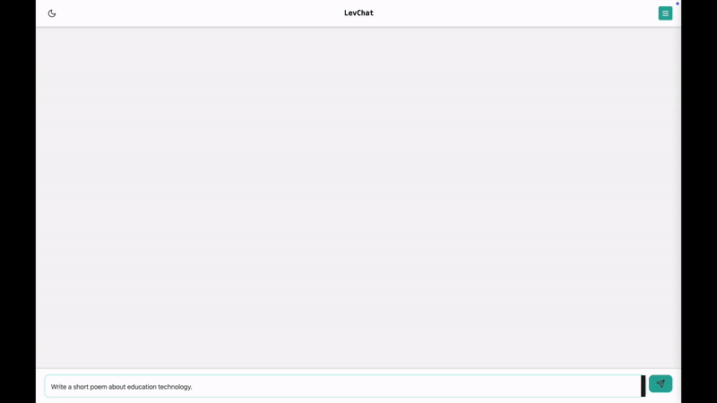

# LevChat

A desktop chat application for Local LLM inferencing with optional RAG (Retrieval-Augmented Generation) capabilities.

## Description

LevChat is a lightweight desktop application that allows you to interact with Large Language Models locally on your machine. It supports both standard chat functionality and RAG mode for context-aware conversations using your PDF documents.



> **Note**: The setup script downloads quantized versions of the LLaMA 3.2 3B model and bge-large-en-v1.5 for embedding. You can modify the script to download models of your preference. Browse and download alternative models from [Hugging Face](https://huggingface.co/models?search=gguf).

## Download

Download the latest version of LevChat for your platform from the [releases page](https://github.com/edielam/lev-chat/releases/tag/v0.0.1).

Available builds:
- Windows (x64)
- Linux (AMD64)
- macOS (Apple Silicon)

## Prerequisites

You need to install `llama.cpp` before using LevChat. Choose one of the following installation methods:

### Windows Users
1. Follow this easy [YouTube tutorial](https://www.youtube.com/watch?v=r-05yuXTEPE) installation guide. PS: I don't know this creator nor was I paid to promote his content.
2. For setup, see the Windows Setup section below

### Linux and Mac Users
```bash
brew install llama.cpp
```

For detailed installation instructions, refer to the official llama.cpp documentation:
- [Build Guide](https://github.com/ggerganov/llama.cpp/blob/master/docs/build.md)
- [Docker Guide](https://github.com/ggerganov/llama.cpp/blob/master/docs/docker.md)
- [Installation Guide](https://github.com/ggerganov/llama.cpp/blob/master/docs/install.md)

## Setup

### Linux and MacOS
Simply run the provided `setup_levchat.sh` script:
```bash
chmod +x setup_levchat.sh
./setup_levchat.sh
```

The script will download specified model into required folder.

### Windows Setup
Since Windows doesn't natively support Bash scripts, download the model manually:

1. Download [Llama-3.2-3B-Instruct-GGUF](https://huggingface.co/bartowski/Llama-3.2-3B-Instruct-GGUF/resolve/main/Llama-3.2-3B-Instruct-Q6_K.gguf)
2. Save it as `Llama-3.2-3B-Instruct-Q6_K.gguf` in:
   ```
   C:\Users\YourUsername\Documents\LevChat\model\
   ```
3. Download [bge-large-en-v1.5-f16.gguf](https://huggingface.co/CompendiumLabs/bge-large-en-v1.5-gguf/resolve/main/bge-large-en-v1.5-f16.gguf)
2. Save it as `bge-large-en-v1.5-f16.gguf` in:
   ```
   C:\Users\YourUsername\Documents\LevChat\em_model\
   ```

Alternatively, you can use Windows Subsystem for Linux (WSL) or Git Bash to run the setup script on Windows.

### Directory Structure
After setup, you will have:
```
Documents/LevChat/
├── data/
└── model/
    └── Llama-3.2-3B-Instruct-Q6_K.gguf
└── em_model/
    └── bge-large-en-v1.5-f16.gguf
```

## Usage

### Standard Chat Mode
1. Open the LevChat application
2. Start typing your prompts
3. Enter/Press send button to get responses

### RAG Mode
1. Place your context PDF documents in the `data` folder
2. Start your prompt with "RAG-" to activate RAG mode
3. Your prompts will now consider the content of your PDF documents

### Additional Features
- **Stop Generation**: Use the stop button next to the send button to interrupt model generation, particularly useful during generation loops common with llama.cpp

## License

MIT License

## Author

Edward Lampoh

