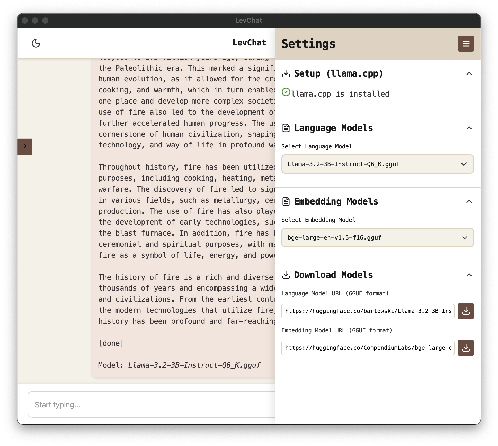

# LevChat  

A desktop chat application for Local LLM inferencing with optional RAG (Retrieval-Augmented Generation) capabilities.  

## Description  

LevChat is a lightweight desktop application that allows you to interact with Large Language Models (LLMs) locally on your machine. It supports standard chat functionality and RAG mode for context-aware conversations using your PDF documents.  

  

## Download  

Download the latest version of LevChat for your platform from the [release page](https://github.com/edielam/lev-chat/releases/tag/v0.0.2).  

Available builds:  
- **Windows (x64)**  
- **Linux (AMD64)**  
- **macOS (Apple Silicon)**  

## Usage  

Upon installation, LevChat automatically creates a folder named `LevChat` in the Documents directory. This folder contains:  
1. **data**: For storing PDF files used in RAG mode.  
2. **setup**: For `llama.cpp` binaries or executables.  
3. **model**: For language models.  
4. **em_model**: For embedding models, used for context similarity search in RAG mode.  

### Setup  

1. **Settings Sidebar**:  
   - Open the settings sidebar by clicking the icon on the top-right corner of the application.  
   - The sidebar has 4 sections:  
     - **llama.cpp Setup**  
     - **Language Models**  
     - **Embedding Models**  
     - **Download**  

  

2. **llama.cpp Detection**:  
   - If `llama.cpp` is detected, it will be displayed in the **llama.cpp Setup** section.  
   - If not, you can manually download the executable using the provided default links or supply a custom download link.  

3. **For macOS Users**:  
   - Simply run `brew install llama.cpp` to install the executable directly.  

4. **Model Management**:  
   - Place your available models in the respective folders:  
     - **Language Models** → `model` folder  
     - **Embedding Models** → `em_model` folder  
   - Alternatively, use the **Model Download** section in the settings sidebar. This feature allows you to download models directly into their respective folders by providing a URL.  

### Standard Chat Mode  

1. Open LevChat.  
2. Start typing your prompts in the input box.  
3. Press Enter or click the send button to get responses.  

### RAG Mode  

1. Place context PDF documents in the `data` folder.  
2. Start your prompt with **"RAG-"** to activate RAG mode.  
3. LevChat will now use the content of the PDF documents to enhance its responses. 
 

### Additional Features  

- **Stop Generation**:  
  - Use the stop button next to the send button to interrupt model generation, particularly helpful during looping responses with llama.cpp.  

## Prerequisites  

`llama.cpp` is required for LevChat. You can easily download and configure the appropriate `llama.cpp` executables for your system via the UI. For Mac users, simply run `brew install llama.cpp`. 

For manual setup:  
- Download the correct executable for your platform from the [llama.cpp releases](https://github.com/ggerganov/llama.cpp/releases).  
- Place the executable in the `setup` folder located within the `LevChat` directory in your Documents folder.  

Supported platforms include Windows, macOS, and Linux.  

Refer to the official llama.cpp documentation for detailed instructions:  
- [Build Guide](https://github.com/ggerganov/llama.cpp/blob/master/docs/build.md)  
- [Docker Guide](https://github.com/ggerganov/llama.cpp/blob/master/docs/docker.md)  
- [Installation Guide](https://github.com/ggerganov/llama.cpp/blob/master/docs/install.md)  

## License  

MIT License  

## Author  

Edward Lampoh  
